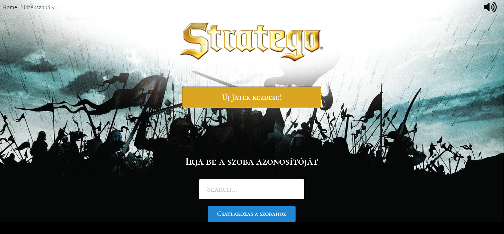

# Stratego
Stratego is a strategy war board game for two players on a board of 10×10 squares (in my implementation the board size is 6×6). Each player controls 40 pieces (in my case 12) representing individual officer and soldier ranks in an army. The pieces have Napoleonic insignia. The objective of the game is to find and capture the opponent's Flag, or to capture so many enemy pieces that the opponent cannot make any further moves. 

The game was originally designed with socket.io to be a real time multiplayer game, but because this was a school project the teacher revoked the server side of the app, thus I had to modify the game to a non real time application. In the near future I want to implement my own backend with socket.io to be able to play the game real time.

## Images and video walkthrough
Example images and a video walkthrough are in the example_images folder

## Installing and running project

Before you install the project, make sure, that your computer has nodejs,npm installed.
In the project directory, you can run:

### `npm install`

This installs the required packages.

### `npm start`

Runs the app in the development mode. 
Open [http://localhost:3000](http://localhost:3000) to view it in the browser.

The page will reload if you make edits. 
You will also see any lint errors in the console.
